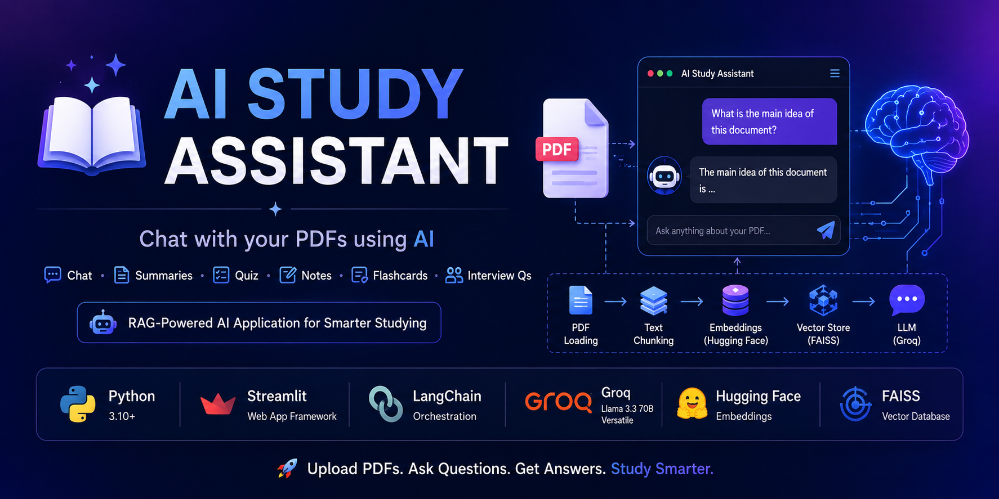
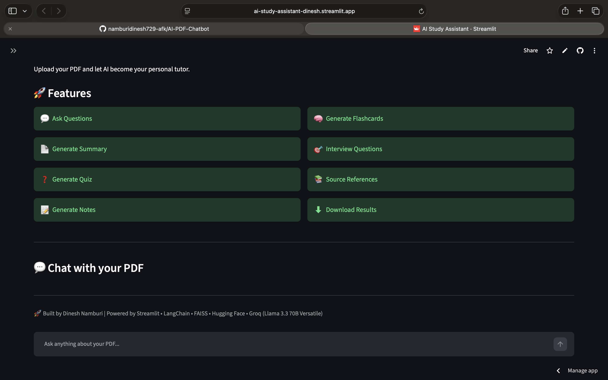
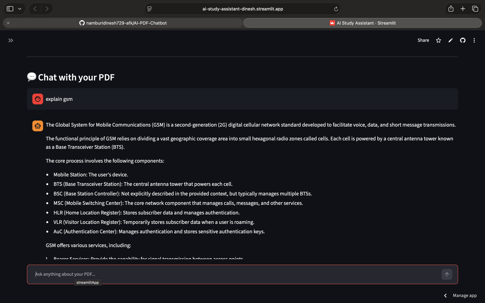
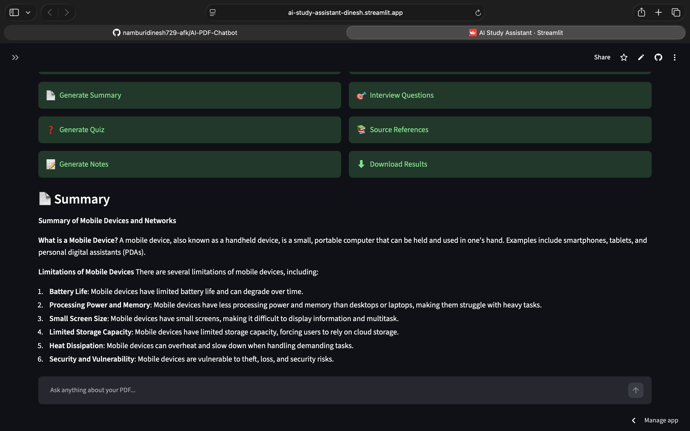
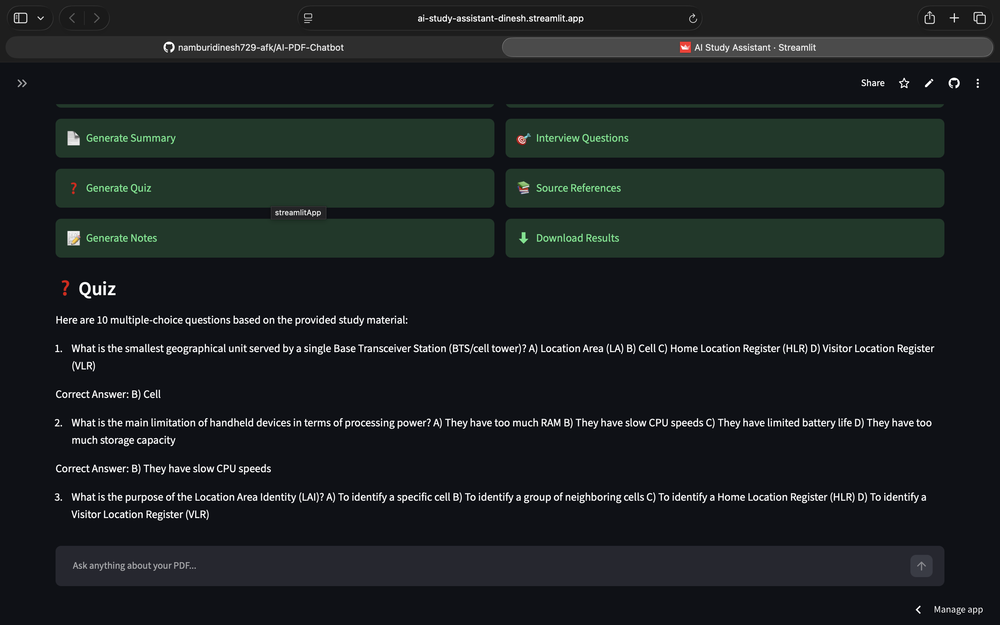

<div align="center">

# 📚 AI Study Assistant

### 🤖 AI-Powered PDF Learning Assistant using RAG

Upload any PDF and instantly chat with it, generate summaries, quizzes, revision notes, flashcards, and interview questions.



<br>

[](https://www.python.org/)
[](https://streamlit.io/)
[](https://python.langchain.com/)
[](https://github.com/facebookresearch/faiss)
[](https://groq.com/)
[](LICENSE)

</div>

---

# 🚀 Live Demo

🌐 **Live App:**  
https://ai-study-assistant-dinesh.streamlit.app

📂 **GitHub Repository:**  
https://github.com/namburidinesh729-afk/AI-PDF-Chatbot

---

# ✨ Features

- 📄 Upload PDF Documents
- 💬 Chat with your PDF
- 📚 Retrieval-Augmented Generation (RAG)
- 🧠 Semantic Search using FAISS
- 📝 AI-generated Summary
- ❓ Multiple Choice Quiz Generator
- 📒 Revision Notes
- 🧠 Flashcards Generator
- 🎯 Interview Questions Generator
- 📄 Source Page References
- ⬇️ Download Generated Content

---

# 📸 Screenshots

## 🏠 Home



---

## 💬 Chat with PDF



---

## 📄 Summary



---

## ❓ Quiz



---

# 🏗 Architecture

```text
                PDF Upload
                     │
                     ▼
              PDF Processing
                     │
                     ▼
              Text Chunking
                     │
                     ▼
     HuggingFace Embeddings
                     │
                     ▼
            FAISS Vector Store
                     │
                     ▼
      Relevant Context Retrieval
                     │
                     ▼
        Groq Llama 3.3 70B Model
                     │
                     ▼
 Chat │ Summary │ Quiz │ Notes │ Flashcards
```

---

# 🛠 Tech Stack

- Python
- Streamlit
- LangChain
- FAISS
- Hugging Face Embeddings
- Groq (Llama 3.3 70B)
- PyPDF2
- dotenv

---

# 📂 Project Structure

```text
AI-PDF-Chatbot/
│
├── assets/
├── core/
├── database/
├── pdf/
├── ui/
├── app.py
├── requirements.txt
└── README.md
```

---

# ⚙ Installation

```bash
git clone https://github.com/namburidinesh729-afk/AI-PDF-Chatbot.git

cd AI-PDF-Chatbot

python -m venv venv

source venv/bin/activate      # macOS/Linux

pip install -r requirements.txt

streamlit run app.py
```

---

# 🔑 Environment Variables

Create a `.env` file in the project root:

```env
GROQ_API_KEY=your_groq_api_key
```

---

# 🎯 Future Improvements

- 🎙 Voice Chat
- 🌐 OCR Support
- 📚 Multi-PDF Chat
- 🌍 Multi-language Support
- 🔊 Text-to-Speech
- 👥 User Authentication
- ☁ Cloud Database

---

# 👨‍💻 Author

**Dinesh Namburi**

- GitHub: https://github.com/namburidinesh729-afk

---

## ⭐ If you like this project, don't forget to star the repository!